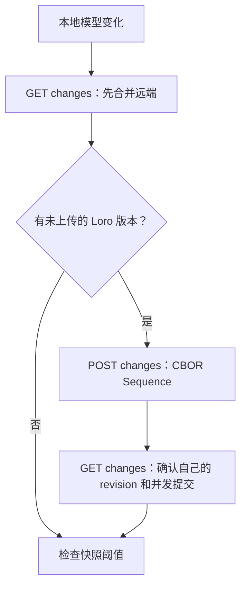

# 自托管同步协议与实现

本文描述 Unthink 当前自托管同步的请求流程、媒体类型、数据保留和已知取舍。同步内容是 Loro CRDT 二进制数据，服务端只负责排序、保存和转发，不解析业务字段。

## 1. 协议概览

同步使用三条链路：

- SSE 只发送“space 已到 revision N”的唤醒信号，不传 CRDT 数据。
- Snapshot 使用单个 `application/cbor` 文档。
- Changes 使用 `application/cbor-seq`，每个 change 是一个独立 CBOR data item。

健康检查、状态、附件配置和错误响应仍是 JSON。客户端声明 `Accept-Encoding: zstd` 时，这些 JSON 响应由 HTTP `Content-Encoding: zstd` 压缩；未声明或不支持时返回 identity。CBOR 与 CBOR Sequence 当前不再叠加 HTTP 压缩，因为 Loro payload 已是紧凑二进制，且保持 item 边界更便于流式处理。

### 核心字段

| 字段 | 含义 |
| --- | --- |
| `space` | 同步空间，即配置中的 folder；服务端规范为小写 |
| `clientId` | 一份设备同步配置的稳定标识，也用于 client lease |
| `changeId` | 上传幂等键；同一 client 重试不会产生新 revision |
| `revision` | space 内每次追加 change 后单调递增的序号 |
| `serverRevision` | 客户端已完整导入到的服务端 revision |
| `snapshotRevision` | 快照覆盖到的 revision |
| `uploadedVersion` | 客户端已知存在于服务端的 Loro 版本向量 |

CBOR 中 `payload` 是 byte string，客户端直接映射为 `Uint8Array`，PostgreSQL 中直接保存为 `BYTEA`。协议中不再使用 Base64，因此没有约 33% 的 Base64 膨胀，也没有重复编码和解码。

## 2. 改动端流程

本地模型变化后，客户端等待 500 ms 防抖，然后执行一轮同步：



1. `GET /changes?after=<serverRevision>` 拉取远端增量。
2. 将每个 CBOR Sequence item 的 payload 导入本地 Loro。
3. 若没有新本地版本，本轮不发送 POST，也不做第二次 GET。
4. 若有新本地版本，导出一个 Loro patch，以单 item CBOR Sequence 调用 `POST /changes`。
5. POST 成功后再 GET 一次，追平刚分配给自己的 revision，并覆盖上传期间的并发提交。
6. revision 与上次 snapshot 相差至少 100 时，尝试上传完整 snapshot。

服务端追加 change 时，在 PostgreSQL 事务中完成幂等检查、space revision 加一、写入 `changes` 和 `pg_notify`。通知在事务提交后才投递，因此接收端收到 revision 时对应数据已经可读。

## 3. 被同步端流程

被同步端保持一个 SSE 长连接：

```http
GET /api/v1/spaces/{space}/events?clientId=<clientId>
Accept: text/event-stream
Authorization: Bearer <AUTH_TOKEN>
```

其他设备提交后，它收到：

```text
id: 13
event: revision
data: 13
```

随后通常只发一次 `GET /changes`。服务端以 `application/cbor-seq` 返回游标之后的 change，客户端导入后更新本地 revision。远端导入期间会屏蔽本地变更触发器，不会把导入再次当成自己的修改上传。

同步期间再收到通知时，只记录最高的 `pendingServerRevision`：

- 当前 GET 已覆盖该 revision：不补请求。
- 当前轮结束后服务端仍更高：再调度一轮。

因此纯远端更新的正常成本是“一条已有 SSE 连接上的事件 + 一次 GET”。接收端同时存在本地待上传修改时，才是 `GET → POST → GET`。

### 快照恢复

`GET /changes` 不再把 snapshot 混入 changes 响应。若客户端游标早于当前 snapshot，服务端返回：

```http
HTTP/1.1 409 Conflict
Content-Type: application/json

{"error":"snapshot required","code":"snapshot_required","snapshotRevision":100}
```

客户端随后：

1. `GET /snapshot` 获取单个 `application/cbor` 快照。
2. 导入快照，把游标移动到 snapshot revision。
3. 再次 `GET /changes?after=<snapshot revision>` 补齐快照之后的增量。

这种拆分让 Snapshot 与增量各自保持稳定媒体类型，也避免在空 changes sequence 中塞入另一种对象。

### 可靠性兜底

- SSE 建立或重连后主动同步一次。
- SSE 断线指数退避重连，最长 30 秒。
- 普通同步失败指数退避，最长 60 秒。
- 恢复在线、窗口聚焦、页面恢复可见时触发同步。
- 每 60 秒执行一次兜底同步。
- SSE 每 25 秒发 heartbeat。

SSE 不是可靠队列，也不按 `Last-Event-ID` 重放；可靠性来自持久化 revision 游标和可重复调用的 changes API。

## 4. 分页、体积和存储增长

`GET /changes` 同时受条数和 payload 字节数限制：

| 参数 | 默认值 | 最大值 |
| --- | ---: | ---: |
| `limit` | 500 条 | 1000 条 |
| `maxBytes` | 2 MiB | 16 MiB |

页面达到任一限制即停止，并通过响应头返回 `nextRevision` 和 `hasMore`。若单个 change 本身超过 `maxBytes`，服务端仍单独返回该 item，避免游标永久卡住；请求体和单次页面的硬上限仍是 16 MiB。

这解决了“500 条小 change”和“500 条大 change”内存占用完全不同的问题。当前 Go 服务端仍会先从数据库读出至多 `limit + 1` 条，再按字节预算截断；它控制了 HTTP 响应体，但极端大行仍会占用服务端内存。进一步优化可在数据库层增加累计字节窗口或按较小批次流式扫描。

### Changes 会不会无限增长

不会在正常运行下无限增长，但增长是否能被回收取决于 snapshot 和 client lease：

1. 客户端每相差 100 revision 上传一次快照。
2. 清理水位为 `min(snapshotRevision, 所有有效 client 的 lastSeenRevision)`。
3. 服务端后台每批删除最多 1000 条，避免一次大事务长时间锁表。
4. 删除或切换同步配置时，客户端调用 `DELETE /clients/{clientId}` 主动释放水位。
5. 90 天未续租的 client 自动过期；服务启动时和每小时执行过期清理。

快照允许覆盖一个不超过当前服务端 revision 的历史点。这避免客户端导出快照期间又出现新提交，导致快照永远因“必须恰好等于最新 revision”而失败；快照之后的 changes 会继续保留和补发。

若所有设备长期无法生成快照，changes 仍会增长。运维应监控每个 space 的 `revision - snapshotRevision`、changes 总字节数、最老有效 client 和数据库表膨胀。

## 5. API

除健康检查和静态页面外，接口均要求 Bearer Token。

| 方法 | 路径 | 响应/用途 |
| --- | --- | --- |
| `GET` | `/api/v1/health` | JSON；数据库健康检查 |
| `GET` | `/api/v1/spaces/{space}/status` | JSON；当前 revision 与 snapshot revision |
| `GET` | `/api/v1/spaces/{space}/events` | SSE revision 通知 |
| `GET` | `/api/v1/spaces/{space}/snapshot` | `application/cbor` |
| `PUT` | `/api/v1/spaces/{space}/snapshot` | `application/cbor` |
| `GET` | `/api/v1/spaces/{space}/changes` | `application/cbor-seq` |
| `POST` | `/api/v1/spaces/{space}/changes` | 请求和响应均为 `application/cbor-seq` |
| `DELETE` | `/api/v1/spaces/{space}/clients/{clientId}` | 注销 client lease，成功为 204 |
| `PUT/GET` | `/api/v1/attachments/objects/{key...}` | 附件二进制上传/下载 |

`GET /status` 同时返回 `protocol: 2`。客户端新增或修改服务器配置时会校验该值；服务端和客户端版本不一致会直接提示协议不匹配，不会尝试用 CBOR 解码旧版 JSON 响应。

### GET changes

```http
GET /api/v1/spaces/{space}/changes?after=9&clientId=device-b&limit=500&maxBytes=2097152
Accept: application/cbor-seq
```

成功响应头：

```http
Content-Type: application/cbor-seq
X-Unthink-Revision: 13
X-Unthink-Next-Revision: 13
X-Unthink-Has-More: false
X-Unthink-Payload-Bytes: 42817
X-Unthink-Snapshot-Revision: 0
```

body 是零个或多个连续 CBOR data item，每个 item 的字段为：

```text
{
  "revision": 13,
  "clientId": "device-a",
  "changeId": "uuid",
  "payload": h'...',
  "createdAt": 1784050001000
}
```

空页是合法的空 body，元数据仍在响应头中。`X-Unthink-Revision` 是本次一致性读取看到的最高 revision；分页继续使用 `X-Unthink-Next-Revision`。

### POST changes

```http
POST /api/v1/spaces/{space}/changes
Content-Type: application/cbor-seq
Accept: application/cbor-seq
```

请求 body 每个 item：

```text
{"clientId":"device-a","changeId":"uuid","payload":h'...'}
```

响应按请求顺序返回相同数量的 item：

```text
{"revision":13,"duplicate":false}
```

当前客户端一次只提交一个 item，协议允许最多 1000 个，为以后批量上传保留空间。`(space, clientId, changeId)` 唯一，重试返回原 revision 和 `duplicate: true`。

### Snapshot

读取：

```http
GET /api/v1/spaces/{space}/snapshot
Accept: application/cbor
```

响应是一个 CBOR item：

```text
{"revision":100,"payload":h'...',"createdAt":1784050000000}
```

写入：

```http
PUT /api/v1/spaces/{space}/snapshot
Content-Type: application/cbor
Accept: application/cbor
```

```text
{"clientId":"device-a","coversRevision":100,"payload":h'...'}
```

`coversRevision` 不得大于当前服务端 revision。比现有 snapshot 更旧或相同的上传是幂等无操作。

### JSON zstd

JSON 请求可声明：

```http
Accept-Encoding: zstd
```

服务端在 JSON 响应上设置 `Content-Encoding: zstd` 和 `Vary: Accept-Encoding`。不支持 zstd 的客户端不声明该编码即可；错误响应也遵循相同协商。SSE、附件、CBOR 和 CBOR Sequence 不使用该中间件压缩。

## 6. 当前架构的主要弊端

- PostgreSQL `changes` 是中心化顺序日志，单个热点 space 的追加吞吐受行锁和单调 revision 限制。
- SSE 只是提示，断线、代理缓冲或多实例进程重启都会造成通知丢失；虽不会丢数据，但会退化到轮询延迟。
- 每个 change 作为独立数据库行有索引和行头开销；大量极小 patch 时，元数据占比可能高于 payload。
- 快照由客户端生成，若所有客户端长期离线、暂停或持续失败，服务端无法自行理解 CRDT 并合并日志。
- 90 天 lease 是可用性与历史保留的取舍：超期设备回来必须走 snapshot；若客户端离线超过租期且快照也损坏，就无法仅靠已清理 changes 恢复。
- CBOR Sequence 便于逐 item 解析，但当前浏览器客户端仍先 `arrayBuffer()` 整页再解码，并未实现真正的流式增量导入。
- POST 虽接受多个 sequence item，但当前逐条提交，各 item 各自原子，整个批次不是一个全有或全无的事务。
- 单一 Bearer Token 目前是服务级权限，不提供按用户、space 或设备的细粒度授权与吊销审计。

对于当前个人/小团队自托管规模，这些取舍能保持实现简单。若进入高吞吐或多租户场景，应优先增加每 space 配额与监控、服务端快照 worker、流式 CBOR 解码、批量原子追加以及细粒度认证。

## 7. PostgreSQL 数据

| 表 | 作用 |
| --- | --- |
| `spaces` | space 名称和当前 revision |
| `changes` | 不可变 Loro change，payload 为 `BYTEA` |
| `snapshots` | 每个 space 最新快照，payload 为 `BYTEA` |
| `clients` | client 确认游标和 lease 更新时间 |

多个 API 实例通过 PostgreSQL `LISTEN/NOTIFY` 交换 revision 信号，再转发给各自持有的 SSE 连接；实际同步数据始终通过数据库和 HTTP 拉取。
